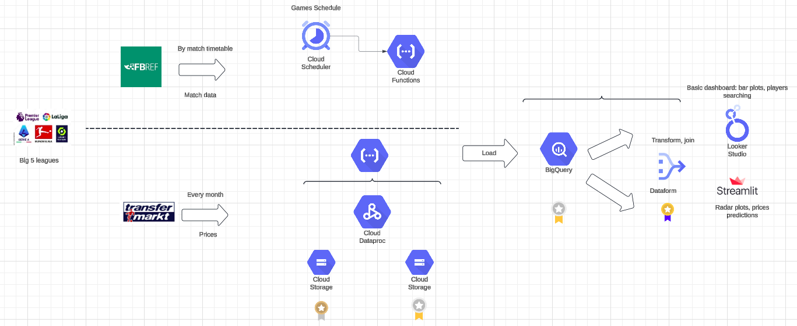
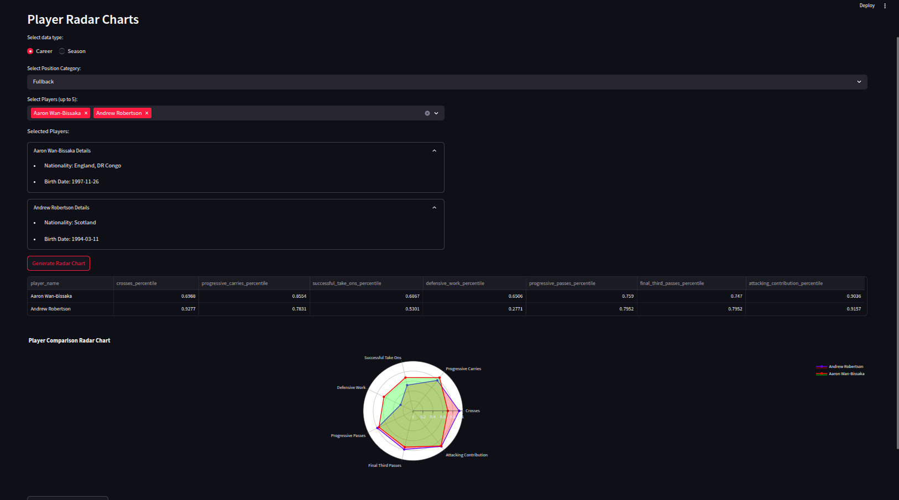

# FootballDataEngeneering

Data Engineering Course Project - building Football Analytics Pipeline

---

## 📊 Overview

This project is built to analyze football data from various sources and transform it into valuable insights through a
complete ELT pipeline. The final results include dashboards, predictive models, and interactive tools that serve
multiple stakeholders such as coaches, scouts, and fans.

---

## 📌 Data Sources

- **[FbRef](https://fbref.com/en/comps/9/stats/Premier-League-Stats)**  
  Player-level statistics updated after every match.

- **[Transfermarkt](https://www.transfermarkt.com/mohamed-salah/profil/spieler/148455)**  
  Tracks player market values. We use [Transfermarkt API](https://transfermarkt-api.fly.dev/docs) to fetch historical
  prices.

---

## 🎯 Final Deliverables

- **Player Performance Dashboard**  
  Interactive radar plots & stat comparisons.

- **Recommendation System**  
  Suggest similar players based on position, style, and performance.

- **Player Price Prediction**  
  Estimate market value based on trends & performance metrics.

---

## 👥 Stakeholders & Use Cases

### 1. Head Coaches & Analysts

- Tactical preparation against rivals
- Monitoring in-house squad performance

> *Example:* A club identifies weak zones in the rival defense and adjusts attacking strategies accordingly.

### 2. Scouts

- Search players based on style and budget
- Discover young, undervalued talent

> *Example:* A scout filters for “Midfielders under 25 with high pressing intensity” and finds cost-effective prospects.

### 3. Media & Fans

- Write engaging, stats-driven articles
- Use interactive dashboards for analysis and comparisons

---

## 💼 Business Value

- ⚔ **Better Tactical Adjustments** → Improved in-game strategy
- 🧠 **Data-Driven Selection** → Choose the best XI based on recent trends
- 💸 **Smarter Contracts & Transfers** → Avoid overpaying or signing mismatched players
- 🌟 **Find Hidden Gems** → Empower smaller clubs to compete with smart recruitment

---

## 🧠 Open Questions

- Should we **schedule data fetching daily** or **trigger based on fixtures**?
- How to **efficiently update only new data rows** (e.g., using metadata)?
- Do we use **match-specific** or **aggregated stats**?
- How do we **monitor pipeline progress** end-to-end?
- Should we **start locally with open-source tools** and migrate to cloud later?
- Do we allow users to **define custom stats formulas**, or use predefined ones?

---

## 🏗️ Architecture

Using a **Medallion Architecture** (Bronze → Silver → Gold layers) to ensure clean separation of raw, processed, and
aggregated data.

---

## 🧰 Technologies (GCP-based)

| Purpose                           | Tool                                                  | Description                                                                       |
|-----------------------------------|-------------------------------------------------------|-----------------------------------------------------------------------------------|
| **Data Transformation**           | [Dataform](https://cloud.google.com/dataform)         | SQL-based transformation framework for BigQuery, version-controlled & tested      |
| **Data Warehouse**                | [BigQuery](https://cloud.google.com/bigquery)         | Fully-managed data warehouse optimized for analytics                              |
| **ELT - First Step**              | [Cloud Functions](https://cloud.google.com/functions) | Serverless processing of small match files on upload (triggered by Cloud Storage) |
| **ELT - Bulk Monthly Processing** | [Dataproc](https://cloud.google.com/dataproc)         | Spark-based transformations for monthly data ingestion                            |
| **Dashboard & Viz**               | [Streamlit](https://streamlit.io/)                    | For creating customizable, interactive radar charts and dashboards                |

---

## 📦 Data Pipeline Summary

1. **Bronze Layer (Raw)**
    - Raw match stats parquet files for each player, and price data stored in GCS
    - Triggered ingestion via Cloud Functions

2. **Silver Layer (Cleaned)**
    - Validated and Cleaned data, consistent formats
    - Scheduled with Cloud Compo using Dataproc

3. **Gold Layer (Aggregated & Modeled)**
    - Normalized joined tables of players' radar metrics by positions and price history data ready for dasboard
    - Materialized using Dataform into BigQuery

---

## 📈 Visualization

- Radar plots, trend lines, and scatter plots for player comparison
- Filters by age, position, team style

---
